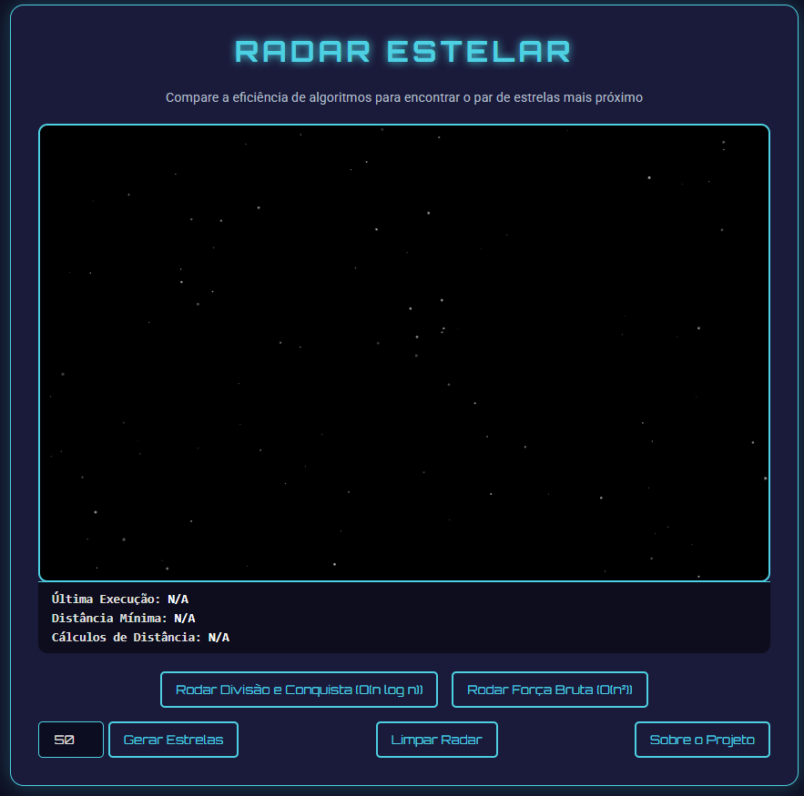
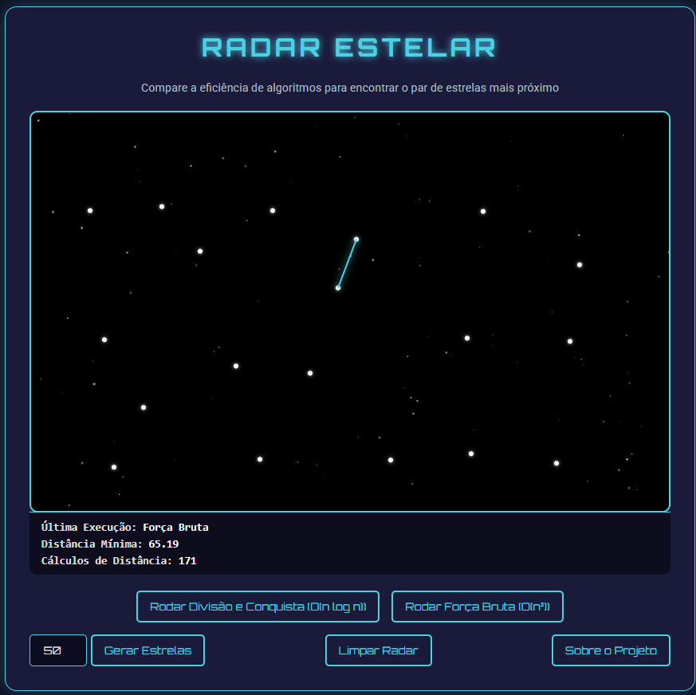
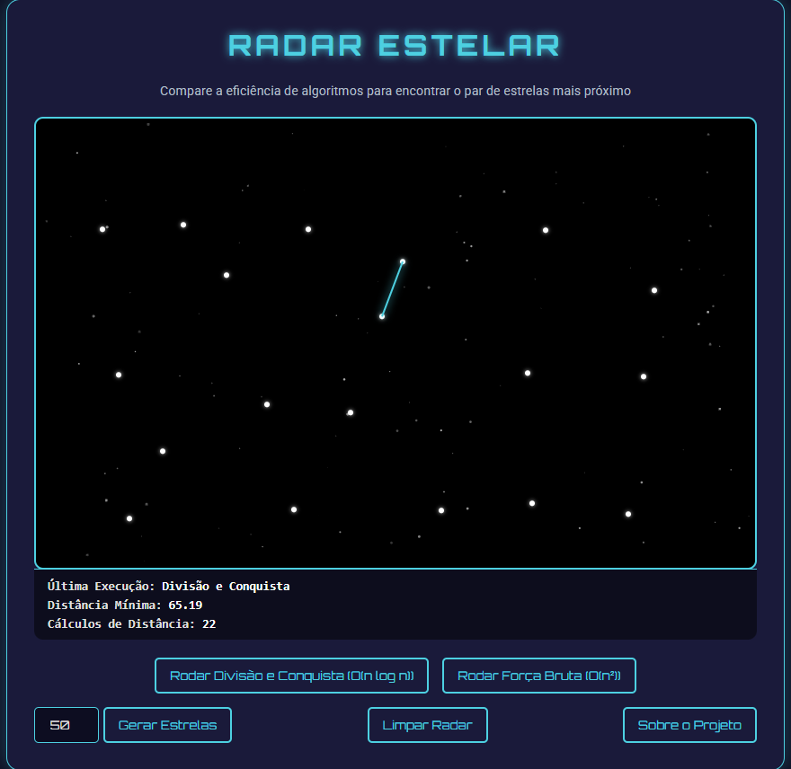
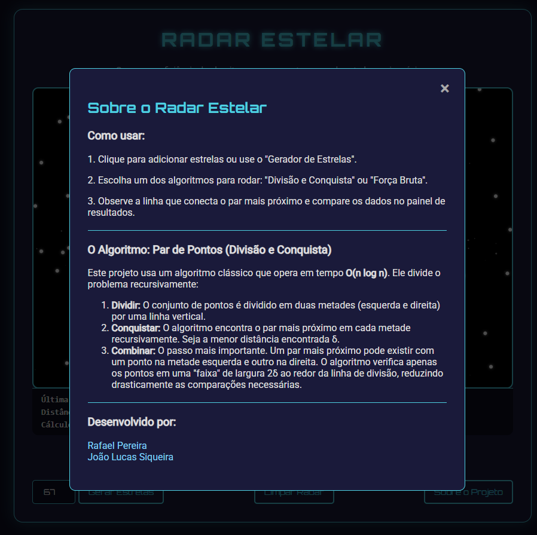

# Radar-Estelar

**Número da Lista**: X<br>
**Conteúdo da Disciplina**: Dividir & Conquistar<br>

## Alunos

|Matrícula | Aluno |
| -- | -- |
| 222015248  |  Rafael Gomes Pereira |
| 222025324  |  João Lucas Araujo Siqueira |


## Sobre 
O Radar Estelar é uma aplicação interativa que permite visualizar e comparar a eficiência de dois algoritmos utilizados para resolver o problema do par de pontos mais próximo no plano bidimensional. O objetivo do projeto é demonstrar de forma prática e visual como diferentes abordagens algorítmicas resolvem o problema de encontrar dois pontos mais próximos entre si em um conjunto. O projeto permite comparar:

- 🔍 **Força Bruta (O(n²))**
- ⚡ **Divisão e Conquista (O(n log n))**

Além de reforçar conceitos de algoritmos e estruturas de dados, o Radar Estelar também é uma excelente ferramenta didática para experimentação e análise de desempenho.

Acesse: [Radar_Estelar](https://github.com/projeto-de-algoritmos-2025/DC_Radar-Estelar) 

## Screenshots
<center>

<p>
  
  <br>
  <sub>Página Inicial do projeto</sub>
</p>

---

<p>
  
  <br>
<sub>Detalhes após a execução do algoritmo de Força Bruta</sub>
</p>

---

<p>
  
  <br>
<sub>Detalhes após a execução do algoritmo Dividir e Conquistar</sub>
</p>

---

<p>
  
  <br>
<sub>Sobre o Projeto</sub>
</p>

---

</center>

## Instalação

### Pré-requisitos

- Git
- Navegador

---

**Linguagem**: Javascript <br>

**Framework**: Não foi utilizado nenhum framework<br>

**Pré-requisitos:** Git e navegador instalados.<br>

Para executar o projeto localmente, basta clonar o repositório e abrir o arquivo _index.html_, que a aplicação será aberta em seu navegador padrão:


```bash
git clone https://github.com/projeto-de-algoritmos-2025/DC_Radar-Estelar.git
```

Para acessar o projeto online, acesse o site:
[Radar_Estelar](https://projeto-de-algoritmos-2025.github.io/DC_Radar-Estelar/)

---

## Uso

- ⭐ **Adicione Estrelas:** clique no espaço sideral para criar pontos manualmente ou use o botão de geração automática para criar um conjunto aleatório.
- 🚀 **Escolha um Algoritmo:** execute o algoritmo de sua escolha para encontrar o par de estrelas mais próximo.
- 📊 **Compare os Resultados:** visualize a menor distância encontrada, o par de pontos conectados por uma linha e o número de comparações realizadas.
- 💡 **Aprenda mais:** acesse o modal “Sobre o Projeto” para entender os princípios por trás do algoritmo de divisão e conquista.
---


